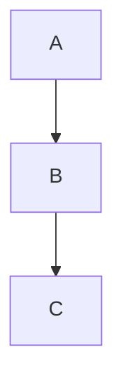

# How to Correctly Render Mermaid from Mermaid.ink in Jupyter Notebook

Mermaid diagrams **do not render directly** if you paste Mermaid.ink Markdown into a Python cell.
Instead, you must use one of the supported approaches below.
Here are the three simplest ways to display Mermaid diagrams inside Jupyter Notebook.

---

## ✔ Option 1 — Use a Markdown Cell (Display Mermaid.ink Image)

If you only want to **display your Mermaid diagram as an image** (PNG or SVG generated by Mermaid.ink):

1. Change the cell type to **Markdown**
2. Paste the Mermaid.ink link exactly as given

_markdown_

```

```

This renders the diagram immediately – no extensions needed.

## ✔ Option 2 — Display Mermaid.ink Image Using Python

If you prefer working in a Python cell, you can display the Mermaid.ink diagram as an image using `IPython.display`:

_python_

```
Image(url="https://mermaid.ink/img/pako:eNpVjkFPg0AQhf_KZk6a0GYBKd09mFiqvTTRxJ6EHjYwsMSyS5YltQL_3W2rRuc0L-97b2aAXBcIHMqDPuZSGEt260wRNw9pIk3d2UZ0ezKb3Y8btKTRCk8jWd1sNOmkbttaVbdXfnWGSDJszxgSK2v1Pl2t5JJ_VjiSdboVrdXt_q-zO-qRPKb1i3T1_x1p0KWe0lLwUsxyYUgizB48aNA0oi7c68M5kIGV2GAG3K0FlqI_2AwyNTlU9Fa_nlQO3JoePTC6ryS4vkPnVN8WwuK6FpURzQ_SCvWm9a-szPnSdxpVgSbRvbLA75YXFvgAH8DDIJyHNGa-HzEWL_zIgxPwiM79IKLUXywYCwLGJg8-L-V0voydQWnA_IjGcRROX0Rle18?type=png")
```

Useful when you want to integrate images into automated Python workflows.

## ✔ Option 3 — Render Mermaid Code Natively Inside Jupyter

To render **raw Mermaid syntax** (not PNG images), install the Mermaid Jupyter extension:

_bash_

```
pip install mermaid
```

Then, in a **Markdown cell**, insert your Mermaid code block:

_markdown_

````

````

This gives you live, editable Mermaid diagrams rendered directly by Jupyter.
