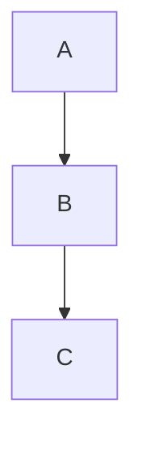

# How to correctly render Mermaid from Mermaid.ink in Jupyter Notebook

You have three working options:

## ✔ Option 1 — Use a Markdown cell (simple image)

If you just want to _display the Mermaid diagram as an image_ (PNG/SVG rendered by mermaid.ink), do this:

1. Change the Jupyter cell type to **Markdown**
2. Paste the Markdown exactly as given:

```markdown

```

This works instantly.

## ✔ Option 2 — Use a Python cell to display the image

from IPython.display import Image

```python

Image(url="https://mermaid.ink/img/pako:eNpVjkFPg0AQhf_KZk6a0GYBKd09mFiqvTTRxJ6EHjYwsMSyS5YltQL_3W2rRuc0L-97b2aAXBcIHMqDPuZSGEt260wRNw9pIk3d2UZ0ezKb3Y8btKTRCk8jWd1sNOmkbttaVbdXfnWGSDJszxgSK2v1Pl2t5JJ_VjiSdboVrdXt_q-zO-qRPKb1i3T1_x1p0KWe0lLwUsxyYUgizB48aNA0oi7c68M5kIGV2GAG3K0FlqI_2AwyNTlU9Fa_nlQO3JoePTC6ryS4vkPnVN8WwuK6FpURzQ_SCvWm9a-szPnSdxpVgSbRvbLA75YXFvgAH8DDIJyHNGa-HzEWL_zIgxPwiM79IKLUXywYCwLGJg8-L-V0voydQWnA_IjGcRROX0Rle18?type=png")

```

## ✔ Option 3 — Render Mermaid directly inside Jupyter (native rendering)

You need the `mermaid` Jupyter extension:

<pre>
```bash

pip install mermaid

```
</pre>

Then in a **Markdown cell:**

````markdown

````
