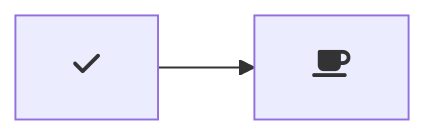

# Using Mermaid in VS Code

Install `Markdown Preview Mermaid Support` extension

## Markdown Preview Mermaid Support

Adds Mermaid diagram and flowchart support to VS Code's builtin Markdown preview and to Markdown cells in notebooks.

A mermaid diagram in VS Code's built-in markdown preview

Currently supports Mermaid version 11.12.0.

Usage
Create diagrams in markdown using mermaid fenced code blocks:

You can also use ::: blocks:

::: mermaid
graph TD;
A-->B;
A-->C;
B-->D;
C-->D;
:::

Supports MDI and logos icons from Iconify:

```mermaid
architecture-beta
    service user(mdi:account)
    service lambda(logos:aws-lambda)

    user:R --> L:lambda
```

Configuration
markdown-mermaid.lightModeTheme — Configures the Mermaid theme used when VS Code is using a light color theme. Supported values are: "base", "forest", "dark", "default", "neutral". Currently not supported in notebooks.

markdown-mermaid.darkModeTheme — Configures the Mermaid theme used when VS Code is using a dark color theme. Supported values are: "base", "forest", "dark", "default", "neutral". Currently not supported in notebooks.

markdown-mermaid.languages — Configures language ids for Mermaid code blocks. The default is ["mermaid"].

Using custom CSS in the Markdown Preview
You can use the built-in functionality to add custom CSS. More info can be found in the markdown.styles documentation

For example, add Font Awesome like this:

"markdown.styles": [
"https://use.fontawesome.com/releases/v5.7.1/css/all.css"
]

Use it like this:

- doesn't work, only in enhanced preview, not publishes on GitHub

---

Markdown Preview Enhanced
Author: Yiyi Wang
Downloads: 1M+
ID: shd101wyy.markdown-preview-enhanced
