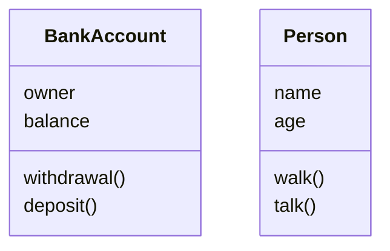
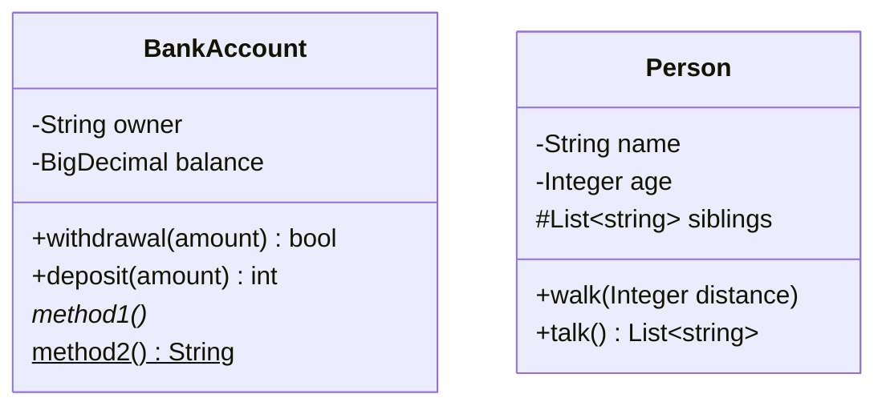
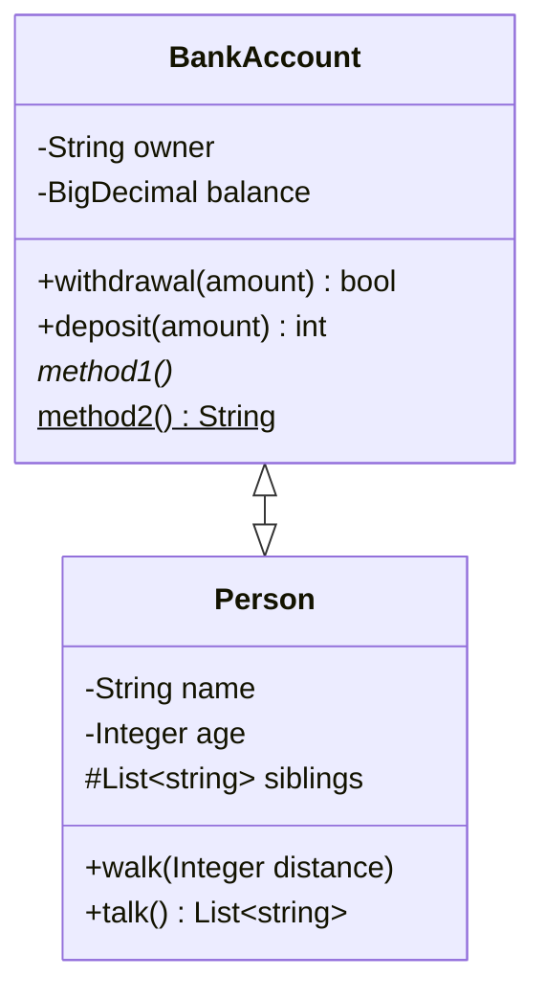
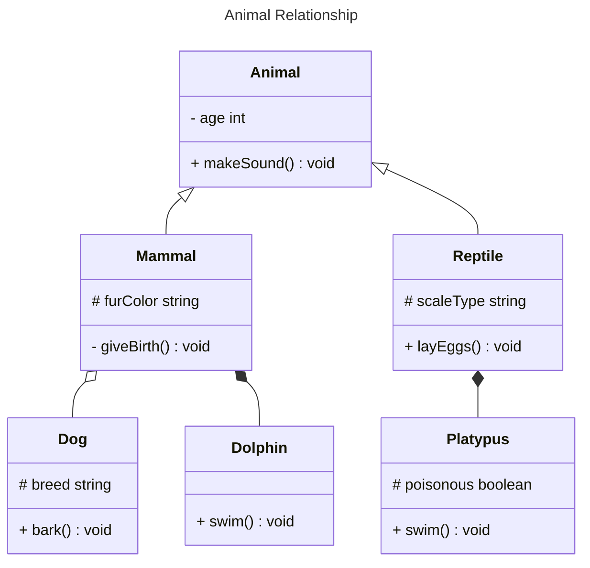
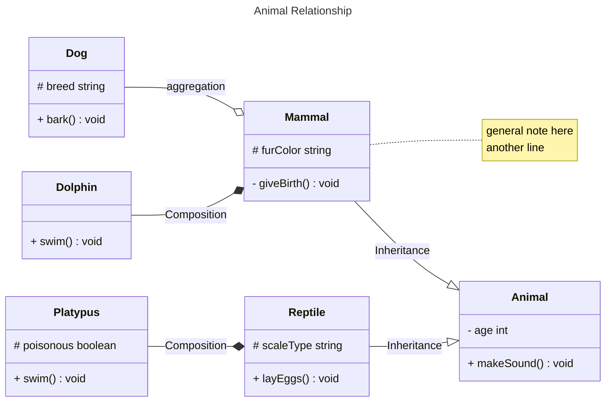

# Class Diagram

---

## Mermaid.js - Class Diagram

- A class diagram is a graphical representation of classes and their relationships in a system. It's a fundamental tool in object-oriented modeling,providing a visual overview of the system's structure and how objects interact with each other.
- It describes the structure of a system by showing the system's classes, their attributes, operations (or methods), and the relationships among objects.
- In a class diagram, classes are represented as rectangles, and the relationships between them are depicted by connecting lines.

---

## Defining a Class Diagram

````

````


---

## Class Visibility and Types

\+ public, accessible to all xml classes
\- private, not accessible to all other classes but itself
\# protected
\~ the class is accessible only for packages which are inherits \* abstract method
\$ static method

````

````


---

## Class relationship

|  Type   |  Description  |
| :-----: | :-----------: |
| `<\|--` |  Inheritance  |
|  `*--`  |  Composition  |
|  `o--`  |  Aggregation  |
|  `-->`  |  Association  |
|  `--`   | Link (Solid)  |
|  `..>`  |  Dependency   |
| `..\|>` |  Realization  |
|  `..`   | Link (dashed) |

````

````


````

````


---

## Titles, Notes, Label and comments

````

````


---

## Cardinality - Multiplicity

- In a class diagram,cardinality is a concept that specifies the number of instances of one class that can be associated with the number of instances of another class. it helps define the multiplicity of associations between classes, indicating how many objects of one class are related to how many objects of another class.
- Cardinality is represented using notations near the ends of association lines between classes. Common symbols include numbers, ranges, and special symbols. here are some examples of cardinality notations:
- Classes can be grouped to have a 1:1, 0:1, 1:N, M:1, M:N

Mermaid cardinality options:

- `1` Only 1
- `0..1` Zero or One
- `1..*` One or more
- `*` many
- `n` n
- `0..n` zero to n
- `1..n` one to n

Cardinality can be easily defined by placing the text option within quotes `"` before or after a given arrow. For example:

---

## Class Annotation

---

## Namespace and Styling

---

## Styling HTML and CSS

---

## Node Interactivity
