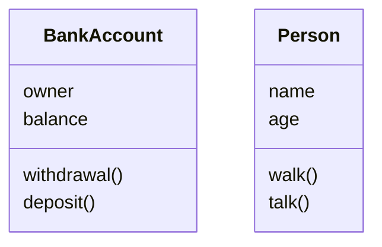
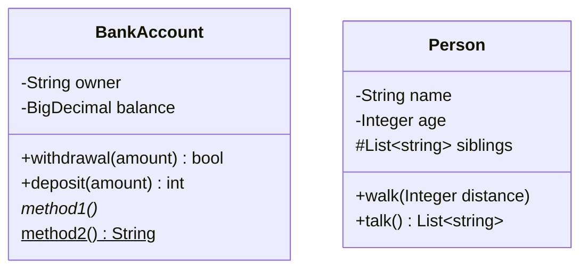
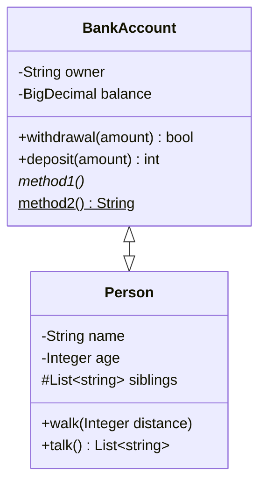
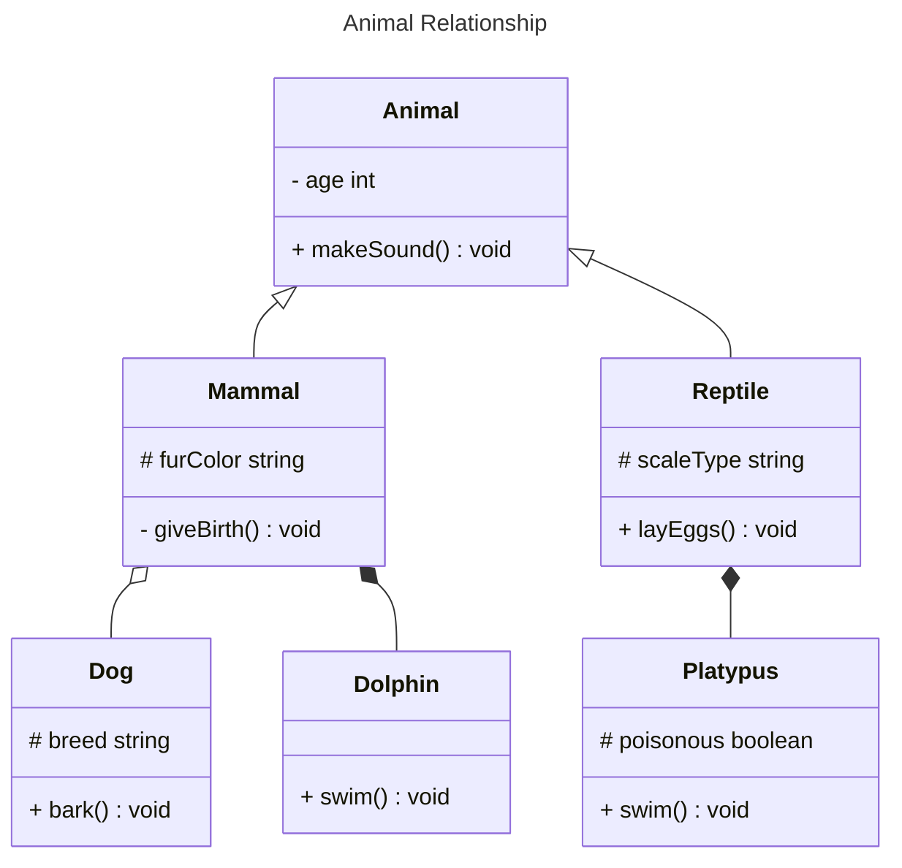

# Class Diagram

---

## Mermaid.js - Class Diagram

- A class diagram is a graphical representation of classes and their relationships in a system. It's a fundamental tool in object-oriented modeling,providing a visual overview of the system's structure and how objects interact with each other.
- It describes the structure of a system by showing the system's classes, their attributes, operations (or methods), and the relationships among objects.
- In a class diagram, classes are represented as rectangles, and the relationships between them are depicted by connecting lines.

---

## Defining a Class Diagram

````

````


---

## Class Visibility and Types

\+ public, accessible to all xml classes
\- private, not accessible to all other classes but itself
\# protected
\~ the class is accessible only for packages which are inherits \* abstract method
\$ static method

````

````


---

## Class relationship

|  Type   |  Description  |
| :-----: | :-----------: |
| `<\|--` |  Inheritance  |
|  `*--`  |  Composition  |
|  `o--`  |  Aggregation  |
|  `-->`  |  Association  |
|  `--`   | Link (Solid)  |
|  `..>`  |  Dependency   |
| `..\|>` |  Realization  |
|  `..`   | Link (dashed) |

````

````


````

````


