# Flowchart Diagram

## Introduction to Flowchart

---

## Flowchart Basics

````
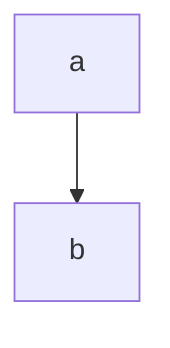
````


---

## Orientation and Error Handling

TD; TB;

````
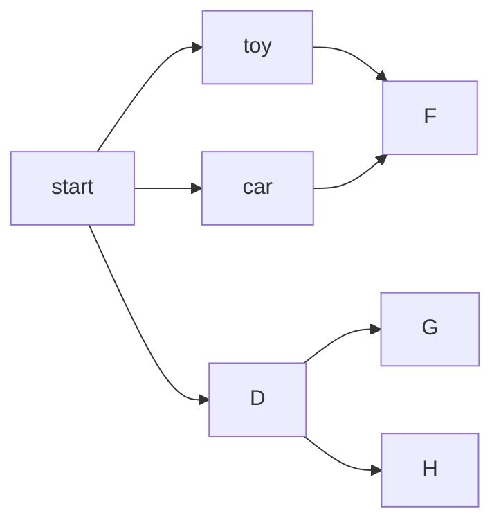
````

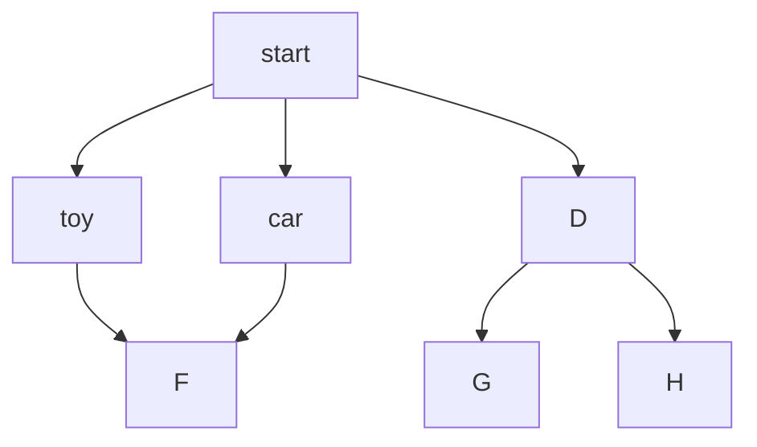

---

## Working with Nodes - Node Text

````
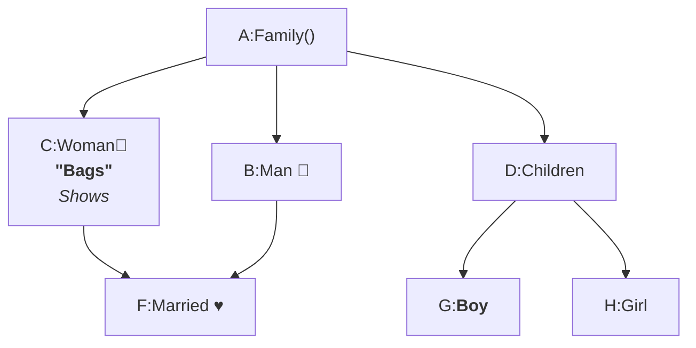
````


---

## Working with Links

### Line connection

````
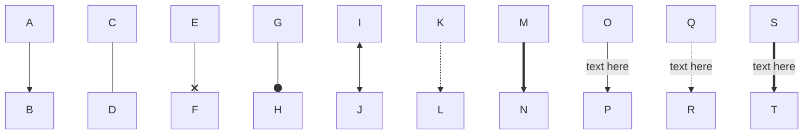
````


### Invisible line connection

````
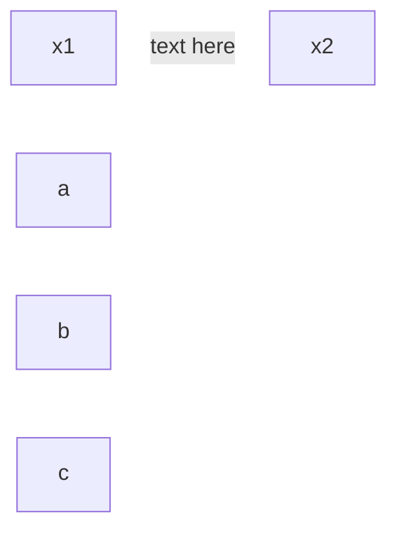
````


---

## More on Working with Links

````
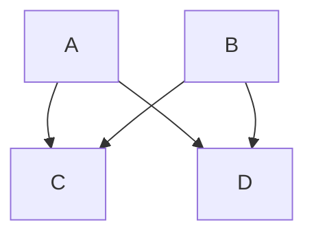
````


````
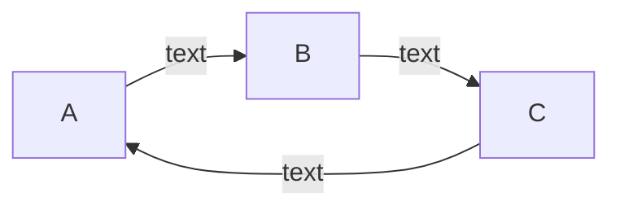
````


````
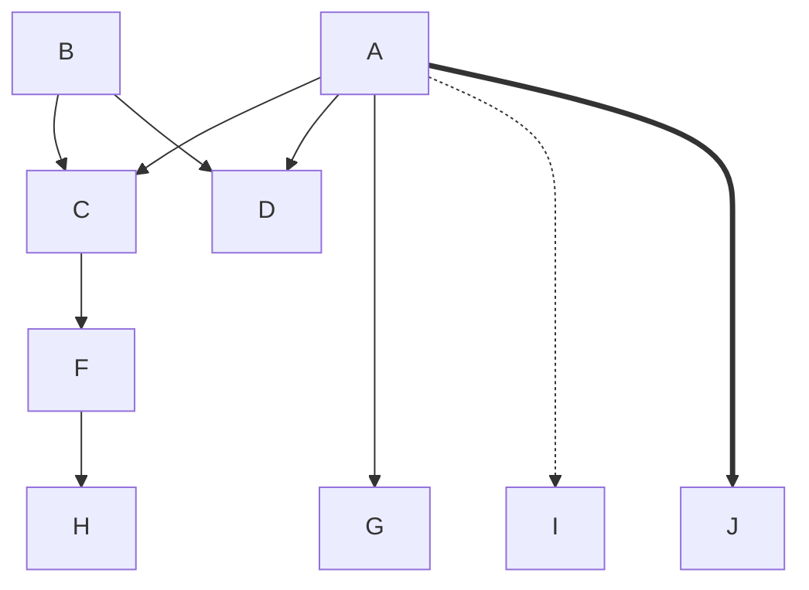
````


````
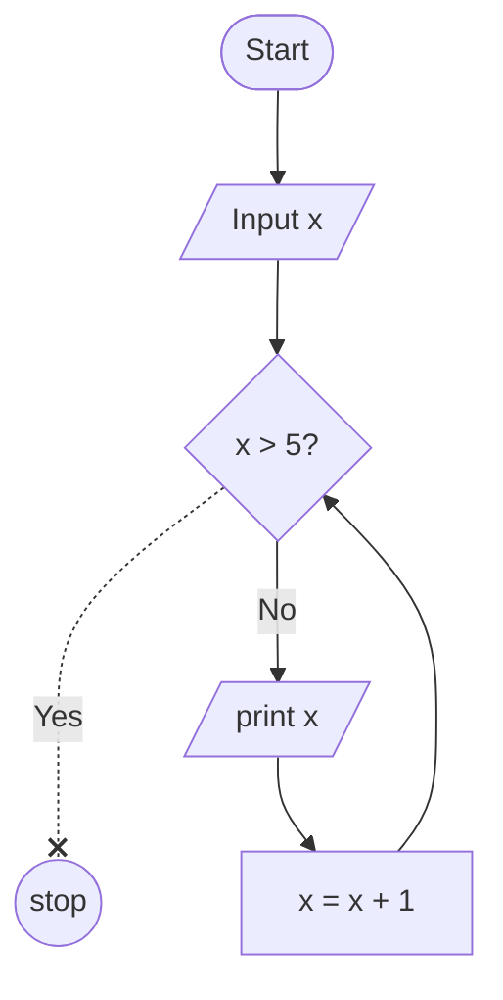
````


---

## Working with Subgraph

````
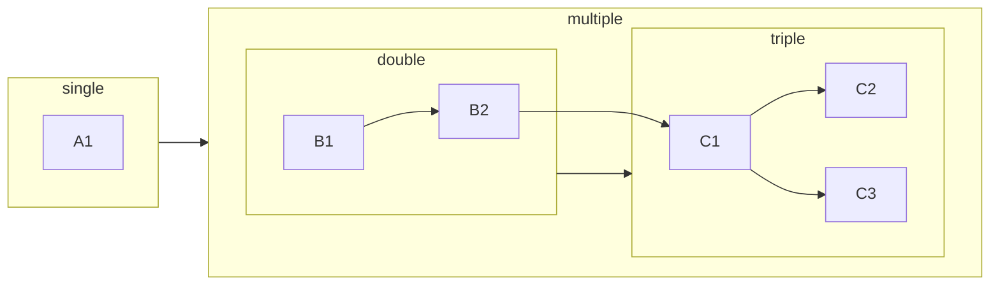
````


---

## Flowchart Node Interactivity

[Flowchart Node Interactivity](https://shap0011.github.io/mermaid-learning-notes/Flowchart%20Node%20Interactivity.html)

---

## Flowchart - Styling Lines and Nodes

[Flowcharts - Basic Syntax](https://mermaid.js.org/syntax/flowchart.html#a-node-with-text)

**Styling line curves**
It is possible to style the type of curve used for lines between items, if the default method does not meet your needs. Available curve styles include `basis`, `bumpX`, `bumpY`, `cardinal`, `catmullRom`, `linear`, `monotoneX`, `monotoneY`, `natural`, `step`, `stepAfter`, and `stepBefore`.

````
```mermaid

%%{
      init:{
            'flowchart':{
                  'curve': 'natural'
            }
      }
}%%
flowchart
      A([Start]):::bigger --> B[/Input x/]
      B --> C{x > 5?}
      C -..-x |Yes| D((stop)):::bigger
      C --> |No| F[/print x/]
      F --> G[x = x + 1]:::nice
      G --> C

      %% class 'bigger' is applied to A(start) and D(stop)

      linkStyle 3,4,5 stroke-width: 4px, stroke: #2180e7ff
      linkStyle 2 stroke-width: 3px, stroke: #e42e2bff

      style B color:#ffffff, font-size:18pt, fill:#00aaff

      classDef bigger font-size:15pt, stroke-width:3px
      classDef nice font-size:17pt, stroke:red, stroke-width:3px
      %% classDef default font-size:15pt, stroke-width:3px
      %% class 'default' applies style to all elements of the diagram

      %% class A,C,D bigger
```
````

```mermaid

%%{
      init:{
            'flowchart':{
                  'curve': 'natural'
            }
      }
}%%
flowchart
      A([Start]):::bigger --> B[/Input x/]
      B --> C{x > 5?}
      C -..-x |Yes| D((stop)):::bigger
      C --> |No| F[/print x/]
      F --> G[x = x + 1]:::nice
      G --> C

      %% class 'bigger' is applied to A(start) and D(stop)

      linkStyle 3,4,5 stroke-width: 4px, stroke: #2180e7ff
      linkStyle 2 stroke-width: 3px, stroke: #e42e2bff

      style B color:#ffffff, font-size:18pt, fill:#00aaff

      classDef bigger font-size:15pt, stroke-width:3px
      classDef nice font-size:17pt, stroke:red, stroke-width:3px
      %% classDef default font-size:15pt, stroke-width:3px
      %% class 'default' applies style to all elements of the diagram

      %% class A,C,D bigger
```
