```mermaid
flowchart
      A["A:Family()"]
      B["B:Man 👨"]
      C["`C:Woman👩
      **#quot;Bags#quot;**
      _Shows_`"]
      A --> B
      A --> C & D[D:Children]
      C --> F[F:Married #9829;]
      B --> F
      D --> G["`G:**Boy**`"]
      D --> H[H:Girl]

```

# Flowchart Diagram

---

## Table of Contents

- [Basic Flowchart Structure](#basic-flowchart-structure)
  - [Orientation & Direction](#orientation--direction)
- [Orientation and Error Handling](#orientation-and-error-handling)
- [Node Text & Formatting](#node-text--formatting)
- [Working with Links](#working-with-links)
  - [Link Types](#link-types)
  - [Line Connection](#line-connection)
  - [Invisible Links](#invisible-links)
- [Advanced Link Patterns](#advanced-link-patterns)
- [Working with Subgraph](#working-with-subgraph)
- [Flowchart Node Interactivity](#flowchart-node-interactivity)
  - [Clickable Nodes](#clickable-nodes)
- [Styling Nodes & Links](#styling-nodes--links)
  - [References](#references)
- [Real-World Example: IT Support Ticket Flow](#real-world-example-it-support-ticket-flow)
- [Real-World Example: IT Support Ticket Flow (Styled)](#real-world-example-it-support-ticket-flow-styled)

---

## Basic Flowchart Structure

- Simple node connections
- Default orientation

````

````


### Orientation & Direction

- TD / TB / LR / BT / RL
- Direction errors and defaults

````

````


````

````


````

````


---

## Orientation and Error Handling

````

````


---

## Node Text & Formatting

- Labels
- Emojis
- Multiline text
- Markdown formatting inside nodes

````

````


---

## Working with Links

### Link Types

- Solid, dashed, dotted
- Terminated links
- Bidirectional links
- Labeled links

### Line connection

````

````


### Invisible Links

- Layout control
- Spacing tricks

````

````


---

## Advanced Link Patterns

- Multi-source → multi-target
- Chained links
- Complex routing

````

````


````

````


````
```mermaid
flowchart
     A --> C
     A --> D
     B --> C
     B --> D
     C --> F --> H
     A ----> G
     A -...-> I
     A ====> J

```
````

```mermaid
flowchart
     A --> C
     A --> D
     B --> C
     B --> D
     C --> F --> H
     A ----> G
     A -...-> I
     A ====> J

```

````
```mermaid
flowchart
      A([Start]) --> B[/Input x/]
      B --> C{x > 5?}
      C -..-x |Yes| D((stop))
      C --> |No| F[/print x/]
      F --> G[x = x + 1]
      G --> C
```
````

```mermaid
flowchart
      A([Start]) --> B[/Input x/]
      B --> C{x > 5?}
      C -..-x |Yes| D((stop))
      C --> |No| F[/print x/]
      F --> G[x = x + 1]
      G --> C
```

---

## Working with Subgraph

- Simple subgraphs
- Nested subgraphs
- Direction overrides

````
```mermaid
graph LR
      subgraph one[single]
            A1
      end

      subgraph multiple
            direction LR
            subgraph two[double]
                  B1 --> B2
            end

            subgraph three[triple]
                  direction LR
                  C1 --> C2 & C3
            end
      end

      one --> multiple
      two --> three
      B2 --> C1

```
````

```mermaid
graph LR
      subgraph one[single]
            A1
      end

      subgraph multiple
            direction LR
            subgraph two[double]
                  B1 --> B2
            end

            subgraph three[triple]
                  direction LR
                  C1 --> C2 & C3
            end
      end

      one --> multiple
      two --> three
      B2 --> C1

```

---

## Flowchart Node Interactivity

### Clickable Nodes

- `click` directive
- External links
- JavaScript callbacks

🔗 Live demo:
[Flowchart Node Interactivity](https://shap0011.github.io/mermaid-learning-notes/Flowchart%20Node%20Interactivity.html)

---

## Styling Nodes & Links

- Curves
- Classes
- `linkStyle`
- `classDef`
- Inline styles

### References

- Official Flowchart Syntax
  [Flowcharts - Basic Syntax](https://mermaid.js.org/syntax/flowchart.html#a-node-with-text)

**Styling line curves**
It is possible to style the type of curve used for lines between items, if the default method does not meet your needs. Available curve styles include `basis`, `bumpX`, `bumpY`, `cardinal`, `catmullRom`, `linear`, `monotoneX`, `monotoneY`, `natural`, `step`, `stepAfter`, and `stepBefore`.

````
```mermaid

%%{
      init:{
            'flowchart':{
                  'curve': 'natural'
            }
      }
}%%
flowchart
      A([Start]):::bigger --> B[/Input x/]
      B --> C{x > 5?}
      C -..-x |Yes| D((stop)):::bigger
      C --> |No| F[/print x/]
      F --> G[x = x + 1]:::nice
      G --> C

      %% class 'bigger' is applied to A(start) and D(stop)

      linkStyle 3,4,5 stroke-width: 4px, stroke: #2180e7ff
      linkStyle 2 stroke-width: 3px, stroke: #e42e2bff

      style B color:#ffffff, font-size:18pt, fill:#00aaff

      classDef bigger font-size:15pt, stroke-width:3px
      classDef nice font-size:17pt, stroke:red, stroke-width:3px
      %% classDef default font-size:15pt, stroke-width:3px
      %% class 'default' applies style to all elements of the diagram

      %% class A,C,D bigger
```
````

```mermaid

%%{
      init:{
            'flowchart':{
                  'curve': 'natural'
            }
      }
}%%
flowchart
      A([Start]):::bigger --> B[/Input x/]
      B --> C{x > 5?}
      C -..-x |Yes| D((stop)):::bigger
      C --> |No| F[/print x/]
      F --> G[x = x + 1]:::nice
      G --> C

      %% class 'bigger' is applied to A(start) and D(stop)

      linkStyle 3,4,5 stroke-width: 4px, stroke: #2180e7ff
      linkStyle 2 stroke-width: 3px, stroke: #e42e2bff

      style B color:#ffffff, font-size:18pt, fill:#00aaff

      classDef bigger font-size:15pt, stroke-width:3px
      classDef nice font-size:17pt, stroke:red, stroke-width:3px
      %% classDef default font-size:15pt, stroke-width:3px
      %% class 'default' applies style to all elements of the diagram

      %% class A,C,D bigger
```

---

## Real-World Example: IT Support Ticket Flow

A practical flowchart showing how an employee submits an IT ticket, how it gets triaged, and what happens for urgent vs. normal requests.

```mermaid
flowchart TD
    A([Employee has an issue]) --> B[Open IT Portal]
    B --> C["Fill out ticket form\n(category, description, attachments)"]
    C --> D{Is it urgent?}

    D -- Yes --> E[Mark as 'Urgent'\nAdd impact + deadline]
    D -- No --> F[Submit as 'Normal']

    E --> G[Submit Ticket]
    F --> G[Submit Ticket]

    G --> H["Ticket Created\n(ID generated)"]
    H --> I["Auto-notify Employee\n(email confirmation)"]

    %% Triage process
    H --> J{Auto-triage rules match?}
    J -- Yes --> K["Assign to correct queue\n(Network / Hardware / Apps)"]
    J -- No --> L[Service Desk reviews\nand categorizes manually]
    L --> K

    %% Parallel actions after assignment
    K --> M{More info needed?}
    M -- Yes --> N[Request clarification\nfrom Employee]
    N --> O[Employee replies\nwith details]
    O --> P[Update ticket]
    P --> Q[Start investigation]
    M -- No --> Q[Start investigation]

    %% Resolution paths
    Q --> R{Resolved?}
    R -- No --> S[Escalate to Tier 2/3\nor vendor]
    S --> Q

    R -- Yes --> T[Provide fix / workaround\nand document steps]
    T --> U[Employee confirms\nissue is fixed]
    U --> V{Employee satisfied?}
    V -- Yes --> W([Close Ticket])
    V -- No --> X[Reopen / continue work]
    X --> Q

    %% Optional grouping (makes diagram easier to read)
    subgraph Auto Notifications
      I
    end

    subgraph Service Desk / IT Team
      J
      K
      L
      M
      N
      O
      P
      Q
      R
      S
      T
    end

```

---

## Real-World Example: IT Support Ticket Flow (Styled)

Here is the styled + class-based version of the Real-World IT Support Ticket Flow, designed to demonstrate styling, classes, and link styles and fit naturally into your “Styling Nodes & Links” section.

```mermaid
%%{
  init:{
    "flowchart":{
      "curve":"natural"
    }
  }
}%%

flowchart TD
    %% Nodes
    A([Employee has an issue]):::startEnd --> B[Open IT Portal]
    B --> C["Fill out ticket form<br/>(category, description, attachments)"]
    C --> D{Is it urgent?}:::decision

    D -- Yes --> E[Mark as Urgent<br/>Add impact & deadline]:::urgent
    D -- No --> F[Submit as Normal]

    E --> G[Submit Ticket]
    F --> G[Submit Ticket]

    G --> H[Ticket Created<br/>ID generated]:::system
    H --> I[Email confirmation sent]:::notification

    %% Triage
    H --> J{Auto-triage rules match?}:::decision
    J -- Yes --> K["Auto-assign to queue<br/>(Network / Hardware / Apps)"]
    J -- No --> L[Service Desk reviews<br/>and categorizes manually]
    L --> K

    %% Investigation
    K --> M{More info needed?}:::decision
    M -- Yes --> N[Request clarification<br/>from employee]
    N --> O[Employee provides details]
    O --> P[Update ticket]
    P --> Q[Start investigation]
    M -- No --> Q[Start investigation]

    %% Resolution loop
    Q --> R{Resolved?}:::decision
    R -- No --> S[Escalate to Tier 2 / Vendor]:::escalation
    S --> Q

    R -- Yes --> T[Provide fix / workaround<br/>Document solution]
    T --> U[Employee confirms fix]
    U --> V{Satisfied?}:::decision
    V -- Yes --> W([Close Ticket]):::startEnd
    V -- No --> X[Reopen ticket]
    X --> Q

    %% Subgraphs
    subgraph Notifications
        I
    end

    subgraph IT Support Team
        J
        K
        L
        M
        N
        O
        P
        Q
        R
        S
        T
    end

    %% Classes
    classDef startEnd fill:#0b7285,color:#ffffff,stroke:#0b7285,stroke-width:2px;
    classDef decision fill:#fff3bf,stroke:#f59f00,stroke-width:2px;
    classDef urgent fill:#ffe3e3,stroke:#fa5252,stroke-width:2px;
    classDef escalation fill:#f8d7da,stroke:#c92a2a,stroke-width:2px;
    classDef system fill:#e7f5ff,stroke:#1c7ed6,stroke-width:2px;
    classDef notification fill:#e6fcf5,stroke:#0ca678,stroke-width:2px;

    %% Link styling
    linkStyle 2 stroke:#fa5252,stroke-width:3px;
    linkStyle 13 stroke:#c92a2a,stroke-width:3px;
```
