```mermaid
flowchart
      A["A:Family()"]
      B["B:Man 👨"]
      C["`C:Woman👩
      **#quot;Bags#quot;**
      _Shows_`"]
      A --> B
      A --> C & D[D:Children]
      C --> F[F:Married #9829;]
      B --> F
      D --> G["`G:**Boy**`"]
      D --> H[H:Girl]

```

# Flowchart Diagram

## Introduction to Flowchart

---

## Flowchart Basics

````

````


---

## Orientation and Error Handling

TD; TB;

````

````


---

## Working with Nodes - Node Text

````

````


---

## Working with Links

### Line connection

````

````


### Invisible line connection

````

````


---

## More on Working with Links

````

````


````

````


````

````


````

````


---

## Working with Subgraph

````

````


---

## Flowchart Node Interactivity

[Flowchart Node Interactivity](https://shap0011.github.io/mermaid-learning-notes/Flowchart%20Node%20Interactivity.html)

---

## Flowchart - Styling Lines and Nodes
