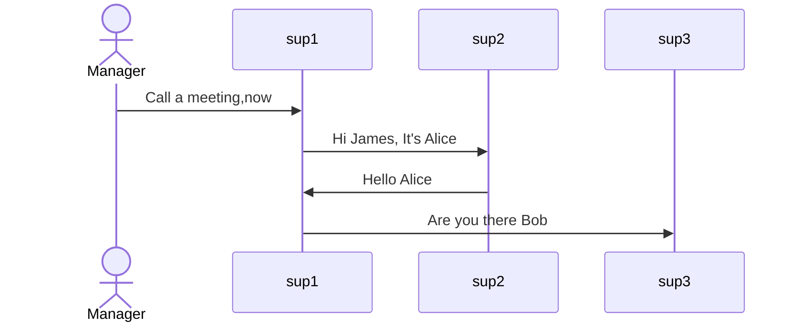
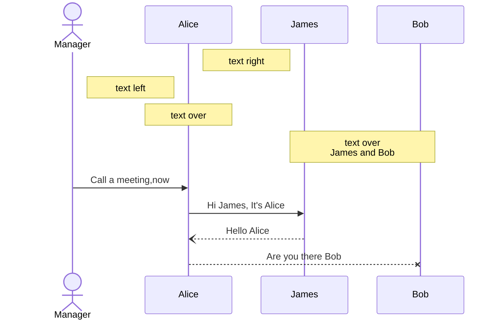
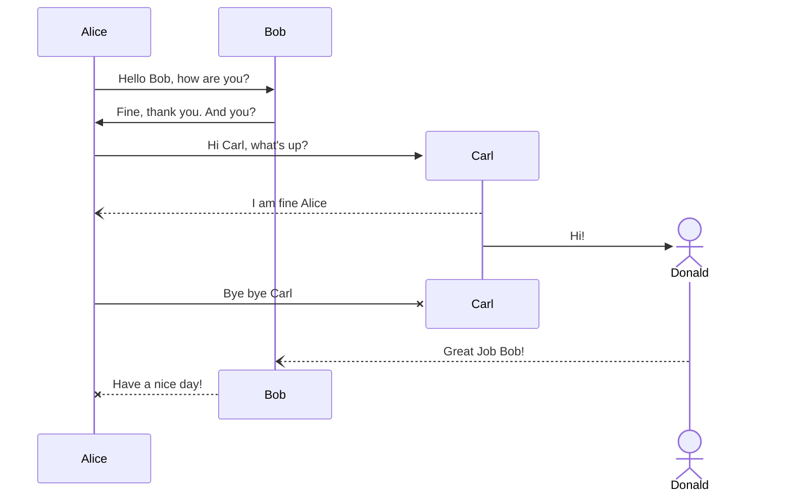
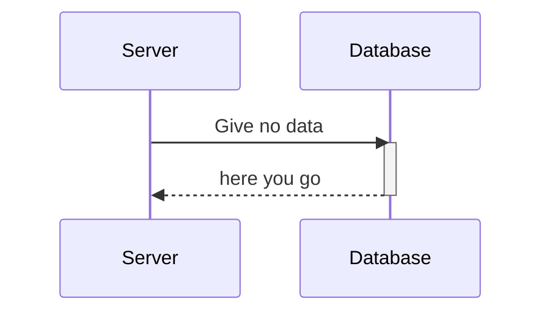
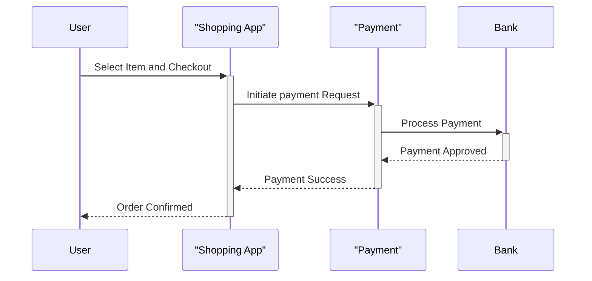
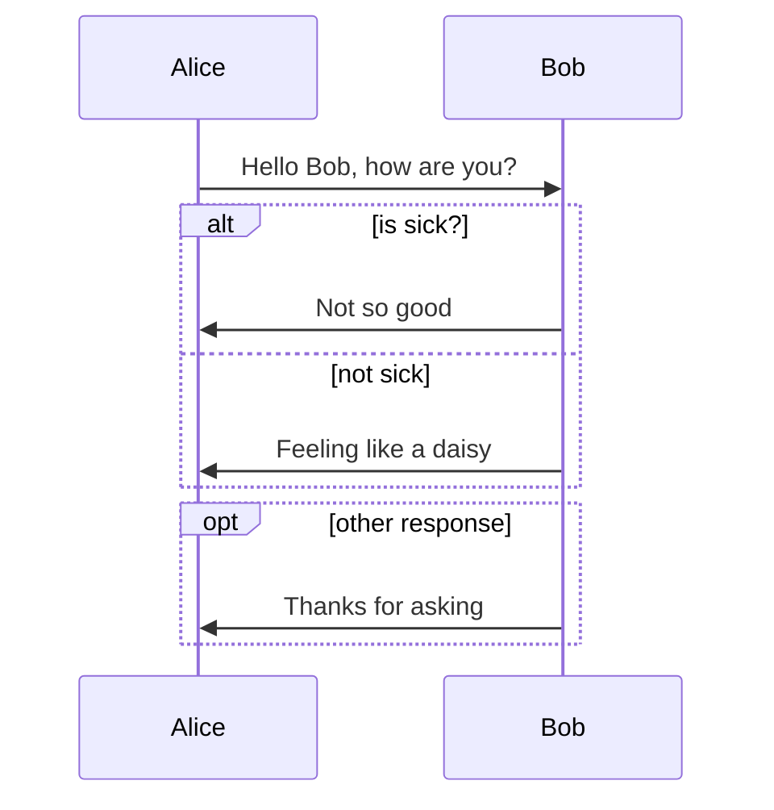
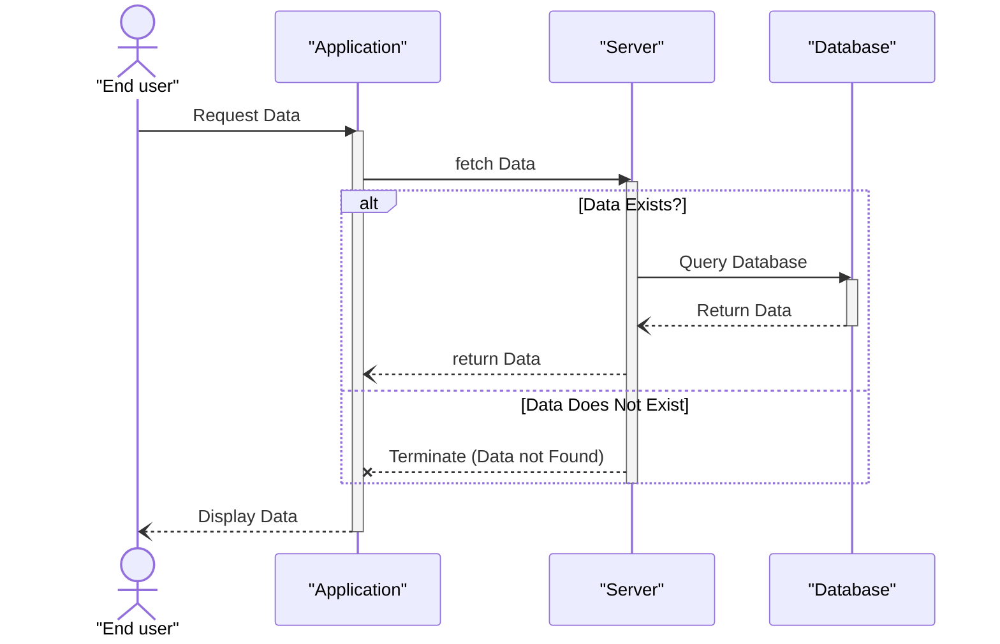
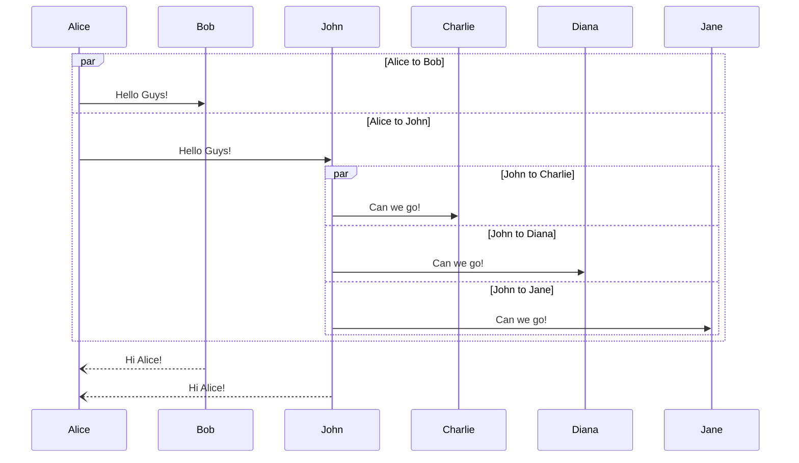
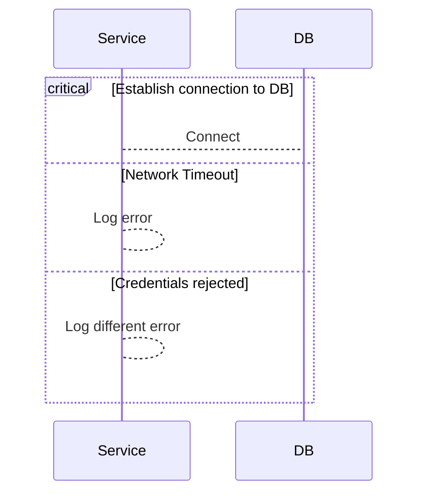
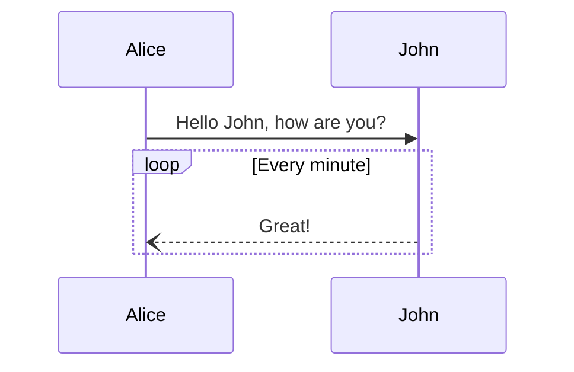

# Sequence Diagram

A sequence diagram is a type of interaction diagram in UML (Unified Modeling Language) that illustrates the flow of messages and interactions between different objects or components within a system over time. It shows how various elements in a system collaborate to achieve a specific functionality or use case.

---

## SD Uses

- **Understanding System Behavior**: Sequence diagrams provide a visual representation of how different components or objects within a system interact and the flow of messages between them. this aids in understanding the overall behavior of the system.
- **Communication**: As a visual communication tool, sequence diagrams facilitate discussions among stakeholders by presenting complex interactions in a clear and accessible format. They are useful for conveying ideas between technical and non-technical team members.
- **Design and Documentation**: During the design phase, sequence diagrams serve as documentation for the dynamic aspects of a system. They offer a blueprint that developers can follow to implement communication patterns between objects or components.
- **Identifying Issues and Improvements**: developers use sequence diagrams to identify potential issues or bottlenecks in a system's communication flow. This visual representation helps optimize and improve system performance.
- **Testing and Validation**: Sequence diagrams are foundational for designing test cases, especially for scenarios involving interactions between different components. They aid in validating that the system behaves as expected in various use cases.
- **System Maintenance**: During system maintenance or updates, sequence diagrams help developers understand existing interactions between components. This understanding is crucial for identifying potential impacts when making changes to the system.
- **Prototyping and Planning**: In the early stages of a project, sequence diagrams aid in prototyping and planning the communication flow between different modules or subsystems. They contribute to the initial design decisions and architecture.
- **Training and Onboarding**: sequence diagrams serve as valuable training tools for new team members or developers. They provide an overview of the system's behavior, making it easier for individuals to understand the project without delving into the entire codebase.

---

## Creating and Connecting Participants

🔗 Mermaid.js reference link:
[Sequence diagrams](https://docs.mermaidchart.com/mermaid-oss/syntax/sequenceDiagram.html)

````

````


---

## Working with messages, Notes and comments

````

````


---

## Sequence Objects Advanced

````

````


---

## Activation Box

````

````


````

````


---

## Alternative Frame 1

(alt..else..end, opt..end)

````

````


---

## Exercise (Actors, participants, Messages, Alt)

(Actor, participant, Activation Box, Alt)

````

````


---

## Alternative frame 2

(Parallel communication)

````

````


---

## Alternative Frame 3

(Critical Region)

````

````


---

## More on Frames

(Loops, Break)

````

````


````
```mermaid
sequenceDiagram
    participant User as "User"
    participant App as "Messaging App"
    participant Server as "Message Server"

    User->>App: OpenMessaging App
    activate App

    loop Check for new Messages
        App->>Server:Request New Message(s)
        activate Server
    end

    App-->>User: Display Messages
    deactivate App

```
````

```mermaid
sequenceDiagram
    participant User as "User"
    participant App as "Messaging App"
    participant Server as "Message Server"

    User->>App: OpenMessaging App
    activate App

    loop Check for new Messages
        App->>Server:Request New Message(s)
        activate Server
    end

    App-->>User: Display Messages
    deactivate App

```

````
```mermaid
sequenceDiagram
    Consumer-->API: Book something
    API-->BookingService: Start booking process
    break when the booking process fails
        API-->Consumer: show failure
    end
    API-->BillingService: Start billing process
```
````

```mermaid
sequenceDiagram
    Consumer-->API: Book something
    API-->BookingService: Start booking process
    break when the booking process fails
        API-->Consumer: show failure
    end
    API-->BillingService: Start billing process
```

---
