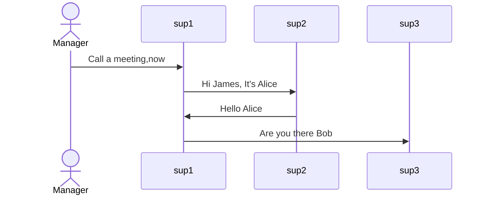
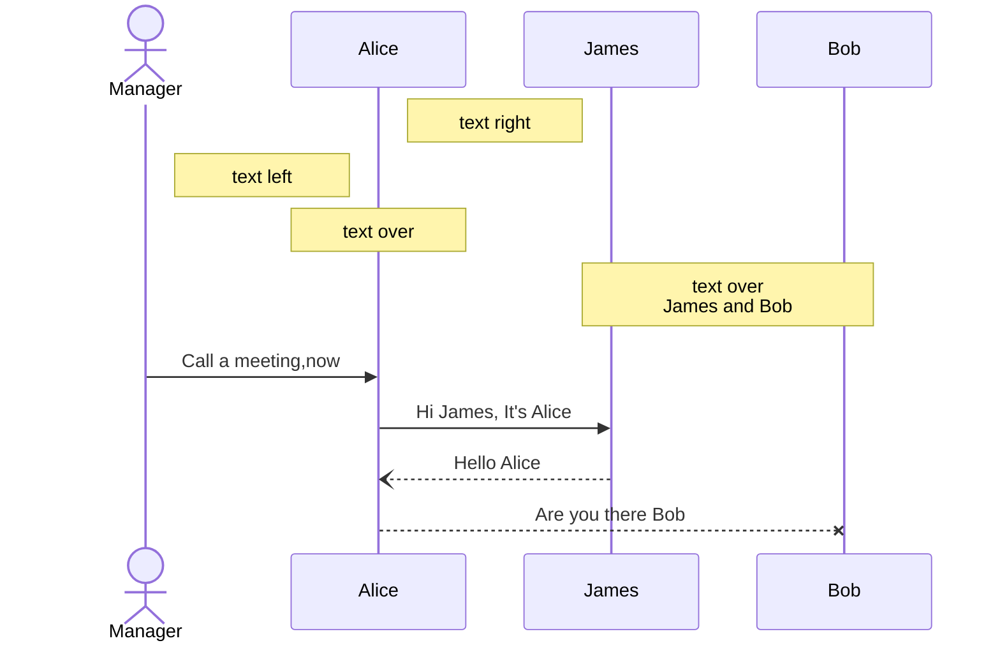
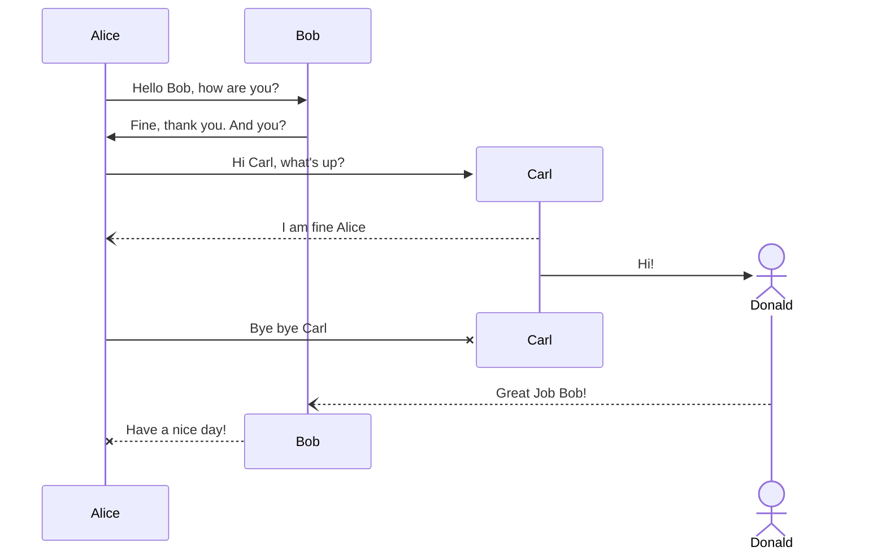
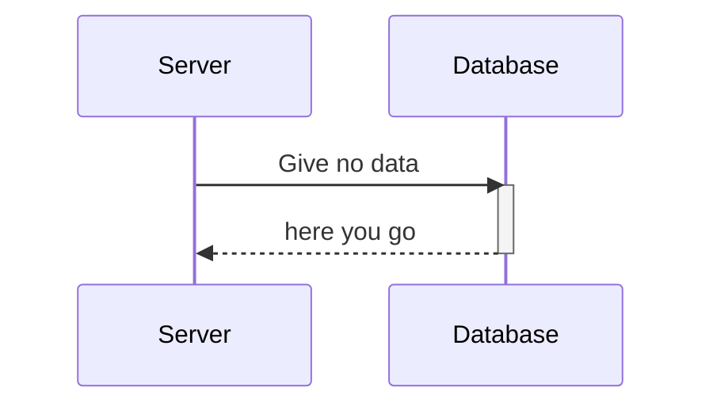
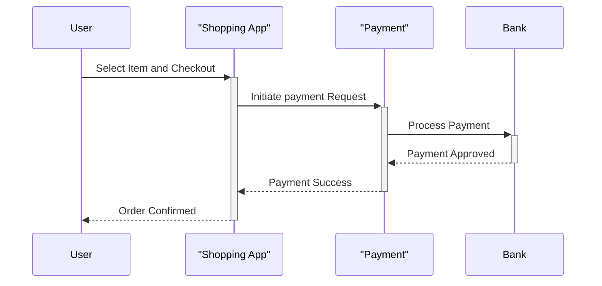
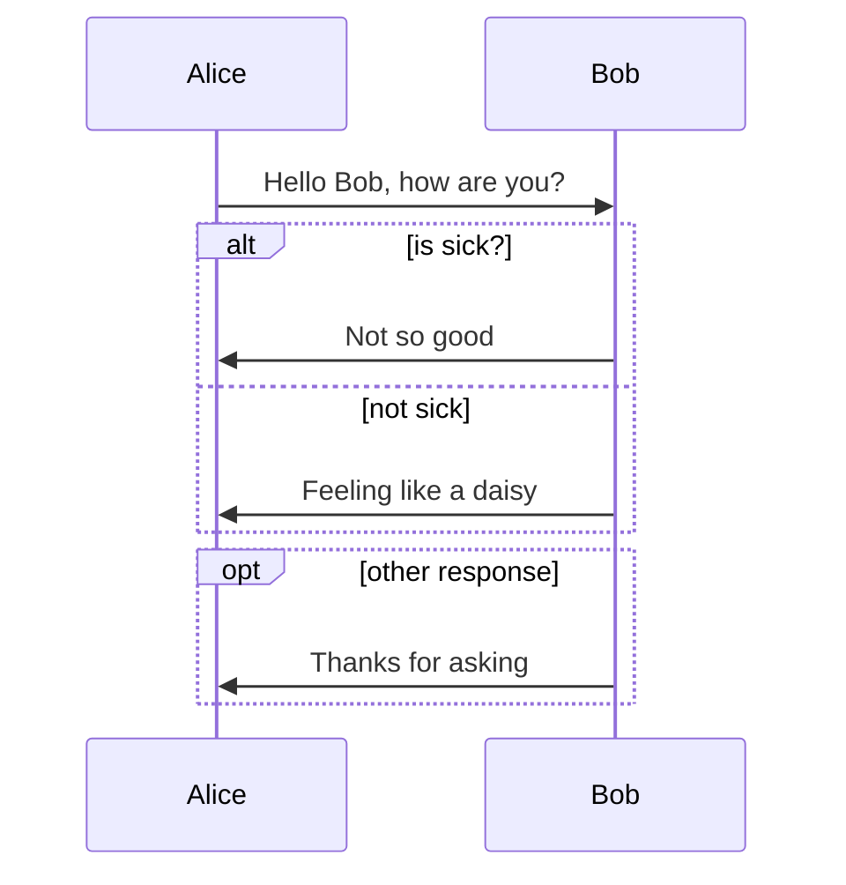
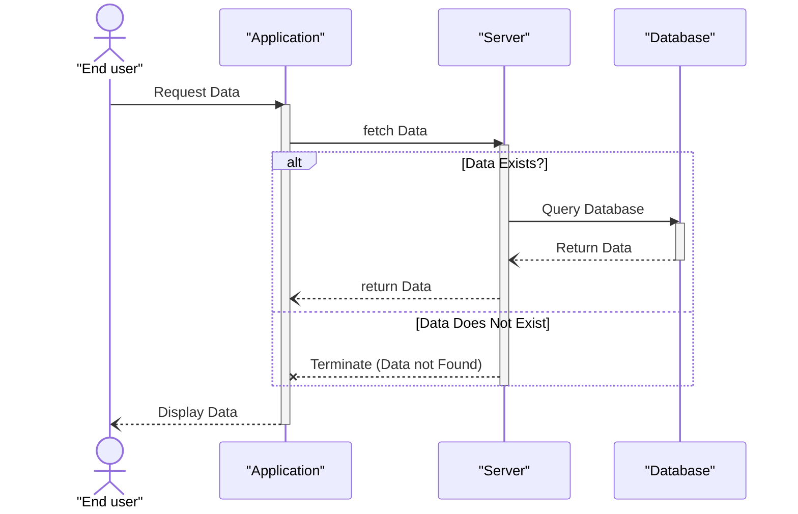
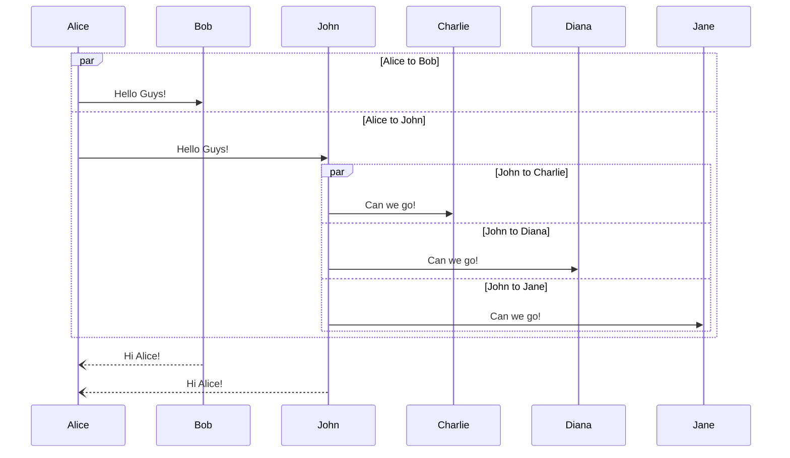
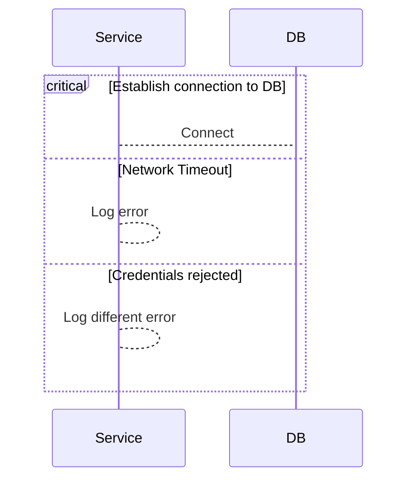
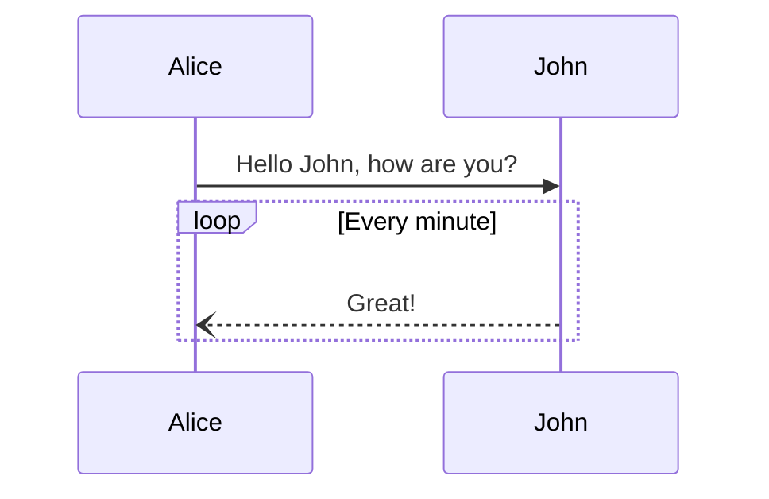

# Sequence Diagram

A sequence diagram is a type of interaction diagram in UML (Unified Modeling Language) that illustrates the flow of messages and interactions between different objects or components within a system over time. It shows how various elements in a system collaborate to achieve a specific functionality or use case.

---

## Table of Contents

- [What you’ll learn](#what-youll-learn)
- [Sequence Diagram Uses](#sequence-diagram-uses)
- [Creating and Connecting Participants](#creating-and-connecting-participants)
- [Working with Messages, Notes and Comments](#working-with-messages-notes-and-comments)
  - [Message Types](#message-types)
  - [Notes and Comments](#notes-and-comments)
- [Sequence Objects Advanced](#sequence-objects-advanced)
- [Activation Box](#activation-box)
- [Conditional Frames (`alt`, `opt`)](#conditional-frames-alt-opt)
- [Exercise (Actors, Participants, Messages, Alt)](#exercise-actors-participants-messages-alt)
- [Parallel Frames (`par`)](#parallel-frames-par)
- [Critical Regions (`critical`)](#critical-regions-critical)
- [More on Frames](#more-on-frames)
- [Grouping and Coloring](#grouping-and-coloring)
- [Common Pitfalls](#common-pitfalls)
- [Configuration Settings](#configuration-settings)
- [Real-World Example: Login Flow](#real-world-example-login-flow)

---

## What you’ll learn

---

- What sequence diagrams are and when to use them
- How to define actors and participants
- Message types, notes, and comments
- Activation boxes and lifelines
- Conditional logic (alt, opt, break)
- Parallel and critical sections
- Grouping, coloring, and layout
- Common configuration options in Mermaid

---

## Sequence Diagram Uses

- **Understanding System Behavior**: Sequence diagrams provide a visual representation of how different components or objects within a system interact and the flow of messages between them. this aids in understanding the overall behavior of the system.
- **Communication**: As a visual communication tool, sequence diagrams facilitate discussions among stakeholders by presenting complex interactions in a clear and accessible format. They are useful for conveying ideas between technical and non-technical team members.
- **Design and Documentation**: During the design phase, sequence diagrams serve as documentation for the dynamic aspects of a system. They offer a blueprint that developers can follow to implement communication patterns between objects or components.
- **Identifying Issues and Improvements**: developers use sequence diagrams to identify potential issues or bottlenecks in a system's communication flow. This visual representation helps optimize and improve system performance.
- **Testing and Validation**: Sequence diagrams are foundational for designing test cases, especially for scenarios involving interactions between different components. They aid in validating that the system behaves as expected in various use cases.
- **System Maintenance**: During system maintenance or updates, sequence diagrams help developers understand existing interactions between components. This understanding is crucial for identifying potential impacts when making changes to the system.
- **Prototyping and Planning**: In the early stages of a project, sequence diagrams aid in prototyping and planning the communication flow between different modules or subsystems. They contribute to the initial design decisions and architecture.
- **Training and Onboarding**: sequence diagrams serve as valuable training tools for new team members or developers. They provide an overview of the system's behavior, making it easier for individuals to understand the project without delving into the entire codebase.

---

## Creating and Connecting Participants

🔗 Mermaid.js reference link:
[Sequence diagrams](https://docs.mermaidchart.com/mermaid-oss/syntax/sequenceDiagram.html)

````

````


---

## Working with messages, Notes and comments

### Message Types

- `->>` synchronous message
- `--)` return message
- `--x` failed or terminated message

These message symbols describe how information flows between participants and help distinguish normal calls, responses, and error cases.

### Notes and Comments

Notes are used to add explanations or context to a sequence diagram without affecting the message flow.
They are especially useful for documentation, teaching, and clarifying complex interactions.

Supported note positions:

- Note right of `<participant>`
- Note left of `<participant>`
- Note over `<participant>`
- Note over `<participant1>`, `<participant2>`

Comments (lines starting with %) are ignored by Mermaid and are useful for documenting the diagram source.

````

````


---

## Sequence Objects Advanced

````

````


---

## Activation Box

````

````


````

````


---

## Conditional Frames (`alt`, `opt`)

(alt..else..end, opt..end)

````

````


---

## Exercise (Actors, participants, Messages, Alt)

(Actor, participant, Activation Box, Alt)

````

````


---

## Parallel Frames (`par`)

(Parallel communication)

````

````


---

## Critical Regions (`critical`)

(Critical Region)

````

````


---

## More on Frames

(Loops, Break)

````

````


````
```mermaid
sequenceDiagram
    participant User as "User"
    participant App as "Messaging App"
    participant Server as "Message Server"

    User->>App: OpenMessaging App
    activate App

    loop Check for new Messages
        App->>Server:Request New Message(s)
        activate Server
    end

    App-->>User: Display Messages
    deactivate App

```
````

```mermaid
sequenceDiagram
    participant User as "User"
    participant App as "Messaging App"
    participant Server as "Message Server"

    User->>App: OpenMessaging App
    activate App

    loop Check for new Messages
        App->>Server:Request New Message(s)
        activate Server
    end

    App-->>User: Display Messages
    deactivate App

```

````
```mermaid
sequenceDiagram
    Consumer-->API: Book something
    API-->BookingService: Start booking process
    break when the booking process fails
        API-->Consumer: show failure
    end
    API-->BillingService: Start billing process
```
````

```mermaid
sequenceDiagram
    Consumer-->API: Book something
    API-->BookingService: Start booking process
    break when the booking process fails
        API-->Consumer: show failure
    end
    API-->BillingService: Start billing process
```

---

## Grouping and Coloring

(box, rect tag)

🔗 W3C Wiki reference link:
[CSS/Properties/color/keywords](https://www.w3.org/wiki/CSS/Properties/color/keywords)

````
```mermaid
sequenceDiagram
    % box rgb(r,g,b,a) Frontend Interface
    box rgb(0,180,190,0.3) Frontend Interface
    % box aqua Frontend Interface
        participant User
        participant App as "Shopping App"
    end

    box blanchedalmond Backend Interface
        participant Gateway as "Payment"
        participant Bank
    end

    rect rgb(255,182,193,.8)
    User->>+App: Select Item and Checkout
    App->>+Gateway: Initiate payment Request
    end
    Gateway->>+Bank: Process Payment
    Bank-->>-Gateway: Payment Approved
    Gateway-->>-App: Payment Success
    App-->>-User: Order Confirmed
```
````

```mermaid
sequenceDiagram
    % box rgb(r,g,b,a) Frontend Interface
    box rgb(0,180,190,0.3) Frontend Interface
    % box aqua Frontend Interface
        participant User
        participant App as "Shopping App"
    end

    box blanchedalmond Backend Interface
        participant Gateway as "Payment"
        participant Bank
    end

    rect rgb(255,182,193,.8)
    User->>+App: Select Item and Checkout
    App->>+Gateway: Initiate payment Request
    end
    Gateway->>+Bank: Process Payment
    Bank-->>-Gateway: Payment Approved
    Gateway-->>-App: Payment Success
    App-->>-User: Order Confirmed
```

---

## Common Pitfalls

- Mermaid config blocks use **YAML, not JSON** (no commas)
- Numeric config values must be numbers, not strings
- VS Code preview is narrower than GitHub — increase `diagramMarginX`
- `showSequenceNumbers: true` makes `% autonumber` redundant

---

## Configuration Settings

Mermaid allows per-diagram configuration using a YAML front-matter block.
This is supported in VS Code, GitHub, and Mermaid Live.

⚠️ YAML rules apply: no commas, correct indentation, numeric values only.

````
```mermaid
---
config:
    # theme: dark
    theme: default
    sequence:
        showSequenceNumbers: true
        diagramMarginX: 60
        diagramMarginY: 30
        noteMargin: 10

---

sequenceDiagram
    participant Alice
    participant John
    Alice->>John: Hello John, how are you?
    note right of John: John got a job
    John--)Alice: Great!
```
````

```mermaid
---
config:
    # theme: dark
    theme: default
    sequence:
        showSequenceNumbers: true
        diagramMarginX: 60
        diagramMarginY: 30
        noteMargin: 10

---

sequenceDiagram
    % autonumber
    participant Alice
    participant John
    Alice->>John: Hello John, how are you?
    note right of John: John got a job
    John--)Alice: Great!
```

---

## Real-World Example: Login Flow

```mermaid
---
config:
  theme: default
  sequence:
    showSequenceNumbers: true
    diagramMarginX: 40
    diagramMarginY: 20
    noteMargin: 10
---

sequenceDiagram
    actor User
    participant UI as "Web App (UI)"
    participant API as "Auth API"
    participant DB as "User DB"
    participant MFA as "MFA Service"
    participant JWT as "Token Service"

    User->>UI: Enter email + password\nClick “Sign in”
    UI->>API: POST /login (credentials)

    API->>DB: Find user by email
    DB-->>API: User record (status, pwdHash, mfaEnabled)

    alt Account locked / disabled
        API--xUI: 403 Account unavailable
        UI-->>User: Show error + support link
    else Account active
        API->>API: Verify password hash
        alt Invalid credentials
            API--xUI: 401 Invalid email/password
            UI-->>User: Show error (try again)
        else Valid credentials
            opt MFA enabled
                API->>MFA: Create MFA challenge
                MFA-->>API: Challenge ID
                API-->>UI: 200 MFA required (challengeId)
                UI-->>User: Prompt for verification code
                User->>UI: Enter MFA code
                UI->>API: POST /login/mfa (challengeId, code)
                API->>MFA: Verify code
                alt MFA failed
                    MFA--xAPI: Invalid/expired code
                    API--xUI: 401 MFA failed
                    UI-->>User: Show error (resend code)
                else MFA success
                    MFA-->>API: Verified
                end
            end

            API->>JWT: Issue access + refresh tokens
            JWT-->>API: Tokens
            API-->>UI: 200 Login success (tokens)
            UI-->>User: Redirect to dashboard
            Note over UI,User: Store tokens securely (prefer HttpOnly cookies)
        end
    end

```
